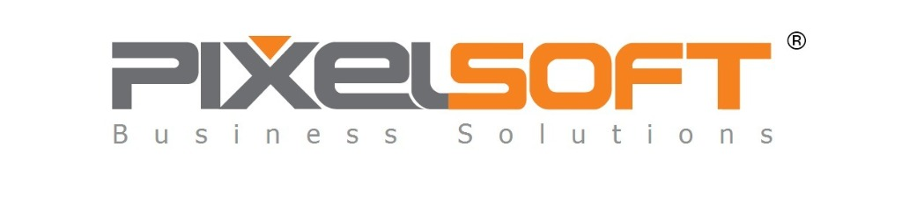

<p align="center">
  
</p>

<h1 align="center">🍽️ Food Ordering App — Backend API</h1>

<p align="center">
  <strong>A collaborative food ordering platform for company employees</strong><br/>
  Built with .NET 9 · Clean Architecture · Real-time session management
</p>

<p align="center">
  
  
  
  
  
</p>

---

## 📖 Overview

**Food App** is a RESTful Web API that enables company employees to collaboratively order food from restaurants. One employee acts as a **host** — opens a session for a specific restaurant — and other employees **join**, pick menu items, and contribute to a shared order. When the host confirms, the delivery cost is **split equally** among all participants, and everyone receives a beautifully designed **HTML email notification** with their order breakdown.

### How It Works

```
1. 🏗️  Host creates a session for a restaurant
2. 📧  All employees receive a branded email notification
3. 👥  Employees join the session and pick items from the menu
4. 🛒  Items are stored temporarily in Redis carts
5. ✅  Host confirms the order → carts become a finalized Order in the database
6. 💰  Delivery cost is split equally among participants
7. 📬  Each participant gets a personalized email with their items & total
8. 🛵  When food arrives, everyone is notified to collect their meal
```

---

## 🏗️ Architecture

The project follows **Onion / Clean Architecture** principles with a clear separation of concerns:

```
┌─────────────────────────────────────────────────────┐
│                    Food.APIs                        │
│          (Controllers, DTOs, Middleware)             │
├─────────────────────┬───────────────────────────────┤
│   Food.Service      │      Food.Repository          │
│  (Business Logic)   │   (Data Access, EF Core)      │
├─────────────────────┴───────────────────────────────┤
│                   Food.Domain                       │
│       (Models, Interfaces, Specifications)          │
│              ⬆ Zero project references ⬆            │
└─────────────────────────────────────────────────────┘
```

| Layer | Responsibility |
|---|---|
| **Food.Domain** | Core entities, enums, DTOs, repository & service interfaces, specification pattern |
| **Food.Repository** | EF Core DbContext, generic repository, unit of work, data seeding |
| **Food.Service** | Session management, order processing, email notifications, JWT tokens, Redis carts |
| **Food.APIs** | REST controllers, AutoMapper profiles, error handling, DI configuration |

---

## ✨ Key Features

### 🔐 Authentication & Authorization
- **ASP.NET Identity** with role-based access (`Admin`, `Employee`)
- **JWT Bearer tokens** for stateless API authentication
- **Refresh token rotation** with secure revocation & cleanup

### 🍔 Session & Order Management
- Full session lifecycle: **Open → Closed → Ordered → Delivered / Cancelled**
- Host-controlled workflow with participant join/leave
- Forward-only order status transitions with validation
- Automatic delivery cost splitting among participants

### ⚡ Redis Cart System
- Temporary carts stored in **Redis** (`cart:{sessionId}:{userId}`)
- 30-day TTL — carts are ephemeral until the order is confirmed
- Bulk cart operations for session-wide reads and cleanup

### 📧 Professional HTML Email Notifications
- **4 branded HTML email templates** with PixelSoft company branding
- Responsive design for all screen sizes
- Personalized emails with order breakdowns, cost summaries, and action steps
- Template engine with `{{placeholder}}` token replacement and in-memory caching
- Powered by **Hangfire** with staggered delivery to respect SMTP rate limits

| Email | Trigger |
|---|---|
| 🆕 New Session | When a host opens a food session |
| ❌ Session Cancelled | When the host cancels an active session |
| ✅ Order Confirmed | When the host confirms — includes items table & cost breakdown |
| 🛵 Order Delivered | When food arrives — includes collection instructions |

### 🔄 Background Processing
- **Hangfire** with SQL Server storage for reliable job persistence
- Orchestrator pattern: one job per notification → individual per-recipient jobs
- Staggered scheduling to stay within SMTP rate limits
- Dashboard available at `/hangfire`

### 📐 Specification Pattern
- Reusable query specifications for filtering, sorting, pagination, and eager loading
- Clean separation between query logic and data access

---

## 🛠️ Tech Stack

| Category | Technology |
|---|---|
| **Framework** | .NET 9, ASP.NET Core Web API |
| **Database** | SQL Server + Entity Framework Core 9 |
| **Cache** | Redis (StackExchange.Redis) |
| **Auth** | ASP.NET Identity + JWT + Refresh Tokens |
| **Background Jobs** | Hangfire (SQL Server storage) |
| **Email** | SMTP (Mailtrap sandbox) with HTML templates |
| **Mapping** | AutoMapper |
| **Logging** | Serilog (console + daily rolling files) |
| **API Docs** | Swagger / Swashbuckle |

---

## 🚀 Getting Started

### Prerequisites

- [.NET 9 SDK](https://dotnet.microsoft.com/download/dotnet/9.0)
- [SQL Server](https://www.microsoft.com/en-us/sql-server/) (LocalDB or full instance)
- [Redis](https://redis.io/) running on `localhost:6379`

### Setup

1. **Clone the repository**
   ```bash
   git clone https://github.com/Abdelrahmanm22/Food-Company.git
   cd Food-Company
   ```

2. **Configure connection strings** in `Food.APIs/appsettings.json`:
   ```json
   {
     "ConnectionStrings": {
       "DefaultConnection": "Server=.;Database=FoodDb;Trusted_Connection=True;MultipleActiveResultSets=true;TrustServerCertificate=True;",
       "RedisConnection": "localhost"
     }
   }
   ```

3. **Configure SMTP** (optional — uses [Mailtrap](https://mailtrap.io/) sandbox):
   ```json
   {
     "SmtpSettings": {
       "Host": "sandbox.smtp.mailtrap.io",
       "Port": "587",
       "Username": "your-mailtrap-username",
       "Password": "your-mailtrap-password",
       "From": "your-email@example.com"
     }
   }
   ```

4. **Run the application**
   ```bash
   cd Food.APIs
   dotnet run
   ```

5. **Access the API**
   - 🌐 API: `https://localhost:7199`
   - 📄 Swagger UI: `https://localhost:7199/swagger`
   - 📊 Hangfire Dashboard: `https://localhost:7199/hangfire`

> **Note:** The database is automatically migrated and seeded on startup with sample restaurants, departments, and users.

### Seed Data

The app seeds initial data on first run:

| Entity | Seed Data |
|---|---|
| **Roles** | `Admin`, `Employee` |
| **Users** | 1 Admin + 3 Employees |
| **Restaurants** | Sample restaurants with categories and menu items |
| **Departments** | Company departments |

---

## 📡 API Endpoints

### 🔑 Authentication
| Method | Endpoint | Description |
|---|---|---|
| `POST` | `/api/Accounts/Register` | Register a new user |
| `POST` | `/api/Accounts/Login` | Login and receive JWT + refresh token |
| `POST` | `/api/Accounts/Logout` | Revoke refresh token |
| `POST` | `/api/Accounts/Refresh` | Rotate refresh token |
| `GET` | `/api/Accounts/me` | Get current user profile |

### 🍕 Restaurants
| Method | Endpoint | Description |
|---|---|---|
| `GET` | `/api/Restaurant` | List restaurants (sorted, paginated) |
| `GET` | `/api/Restaurant/{id}` | Get restaurant with categories |
| `GET` | `/api/Restaurant/{id}/menu` | Get full menu (categories + items) |

### 📋 Sessions
| Method | Endpoint | Description |
|---|---|---|
| `GET` | `/api/Session` | List sessions (filterable) |
| `GET` | `/api/Session/my` | My sessions (host or participant) |
| `GET` | `/api/Session/{id}` | Get session details |
| `POST` | `/api/Session` | Create a new session |
| `POST` | `/api/Session/{id}/join` | Join with items |
| `DELETE` | `/api/Session/{id}/leave` | Leave a session |
| `PUT` | `/api/Session/{id}/close` | Close session (host only) |
| `PUT` | `/api/Session/{id}/cancel` | Cancel session (host only) |
| `GET` | `/api/Session/{id}/carts` | Preview all carts (host only) |

### 🛒 Cart
| Method | Endpoint | Description |
|---|---|---|
| `GET` | `/api/Cart/{sessionId}` | Get my cart |
| `PUT` | `/api/Cart/{sessionId}` | Update my cart items |

### 📦 Orders
| Method | Endpoint | Description |
|---|---|---|
| `POST` | `/api/Order/{sessionId}/confirm` | Confirm order (host only) |
| `PUT` | `/api/Order/{orderId}/status` | Update order status |
| `GET` | `/api/Order/{orderId}` | Get order details |
| `GET` | `/api/Order/session/{sessionId}` | Get order by session |
| `GET` | `/api/Order/my` | My order history |

---

## 📁 Project Structure

```
Food.APP.Solution/
├── Food.Domain/                    # Core Layer (zero dependencies)
│   ├── Models/                     # Entity models
│   ├── Services/                   # Service interfaces
│   ├── Repositories/               # Repository interface
│   ├── Specifications/             # Query specifications
│   ├── Enums/                      # Session/Order status enums
│   └── DTOs/                       # Domain DTOs
│
├── Food.Repository/                # Infrastructure Layer
│   ├── Data/
│   │   ├── FoodContext.cs          # EF Core DbContext
│   │   ├── Configurations/         # Fluent API entity configs
│   │   └── DataSeed/               # JSON seed data
│   ├── GenericRepository.cs        # Generic repository
│   └── UnitOfWork.cs               # Unit of Work pattern
│
├── Food.Service/                   # Business Logic Layer
│   ├── SessionService.cs           # Session lifecycle management
│   ├── OrderService.cs             # Order processing & status
│   ├── EmailService.cs             # HTML email notifications
│   ├── EmailTemplateService.cs     # Template loading & caching
│   ├── RedisCartService.cs         # Redis cart operations
│   └── TokenService.cs             # JWT & refresh tokens
│
├── Food.APIs/                      # Presentation Layer
│   ├── Controllers/                # REST API controllers
│   ├── DTOs/                       # Request/Response DTOs
│   ├── Helpers/                    # AutoMapper profiles
│   ├── Errors/                     # Error response models
│   ├── Middlewares/                # Global exception handling
│   ├── wwwroot/
│   │   ├── images/                 # Static assets (logo)
│   │   └── EmailTemplates/         # HTML email templates
│   └── Program.cs                  # App startup & DI config
│
└── Food.Admin/                     # (Future) Admin Dashboard
```

---

## 🧩 Design Patterns Used

| Pattern | Usage |
|---|---|
| **Clean / Onion Architecture** | Layered project structure with dependency inversion |
| **Repository Pattern** | Generic repository abstraction over EF Core |
| **Unit of Work** | Atomic database operations with transaction support |
| **Specification Pattern** | Reusable, composable query objects |
| **Template Method** | HTML email template engine with placeholder replacement |
| **Background Job Orchestrator** | Hangfire-based fan-out for bulk email notifications |
| **Compensating Action** | Redis rollback on DB failure for mixed-store operations |

---

## 📬 Email Templates Preview

All emails feature the **PixelSoft** brand identity with responsive, modern HTML design:

- 🟠 **New Session** — Orange hero banner, restaurant info card, call-to-action
- ⚫ **Session Cancelled** — Dark hero, red alert card, helpful "what now?" notice
- 🟢 **Order Confirmed** — Green hero, items table, cost breakdown, payment instructions
- 🟠 **Order Delivered** — Warm hero, celebration card, numbered action steps

---

## 📄 License

This project is for educational and portfolio purposes.

---

## 🗺️ Roadmap

| Status | Milestone | Description |
|---|---|---|
| 🔜 | **Admin Dashboard** | Building a full-featured admin panel (`Food.Admin`) for managing restaurants, menus, users, sessions, and viewing order analytics |
| 🔜 | **Production Deployment** | Deploying to a cloud environment for real-world use within our company as an internal food ordering tool |
| 🔜 | **Docker & CI/CD** | Containerizing the application with Docker, creating `docker-compose` for the full stack (API + SQL Server + Redis), and setting up CI/CD pipelines for automated builds, tests, and deployments |

---

<p align="center">
  Built with ❤️ by <strong>Abdelrahman Mohamed</strong>
</p>
